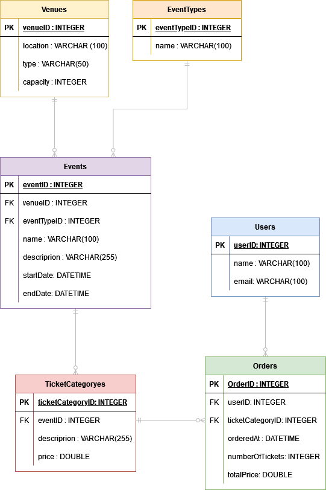
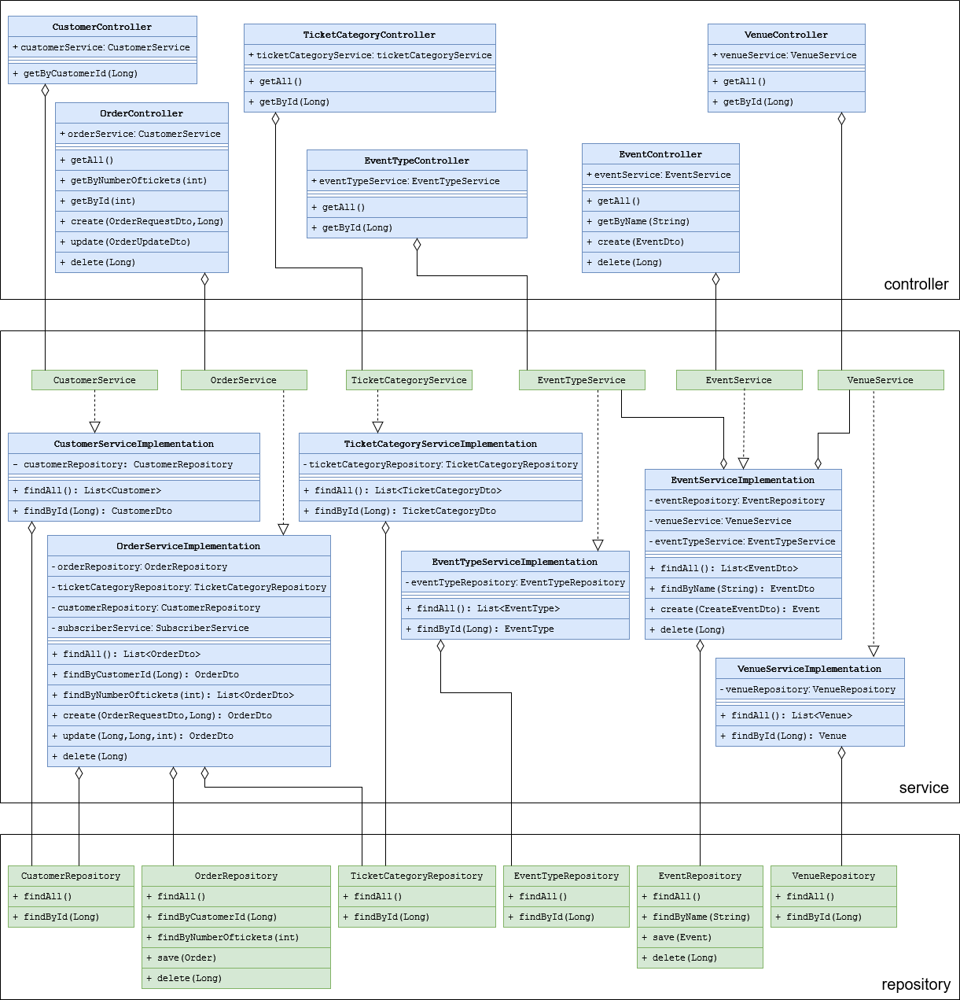

# Event Ticket Sales Management System

## Overview
The Event Ticket Sales Management System is a tool designed for managing the sale of tickets to events. The system allows for the creation of new orders by selecting the ticket type (regular or VIP) and specifying the number of tickets desired, with the corresponding price displayed. The app also allows orders to be viewed and edited by changing the type and number of tickets.

## Key Features
- **Event Selection:** Predetermined events are listed for ticket sales.
- **Order Management:** Users can view all orders and make edits as necessary.
- **Order Creation:** New orders can be created by selecting the ticket type (regular or VIP) and specifying the quantity, with the price automatically calculated and displayed.
- **Search Function:** A search by name function is provided for easier navigation and retrieval of orders and avalabile tickets.
- **Notify Function:** A function that notifys evety customer when an order is placed.

## End Points

### Customer Endpoints
1. **Get Customer by ID**
    - **URL:** `/customer/find/{customerId}`
    - **Method:** `GET`
    - **Description:** Retrieves a customer by their ID.
    - **Response:** `CustomerDto`
    - **Example:** `GET /customer/find/1`

### Event Endpoints
2. **Get Event by Name**
    - **URL:** `/event/findByEventName/{eventName}`
    - **Method:** `GET`
    - **Description:** Retrieves an event by its name.
    - **Response:** `EventDto`
    - **Example:** `GET /event/findByEventName/Concert`

3. **Get Event by Venue ID and Event Type**
    - **URL:** `/event/findByVenueIDAndEventType/{venueID}/{eventType}`
    - **Method:** `GET`
    - **Description:** Retrieves an event by its venue ID and event type.
    - **Response:** `EventDto`
    - **Example:** `GET /event/findByVenueIDAndEventType/1/Music`

4. **Get All Events**
    - **URL:** `/event/all`
    - **Method:** `GET`
    - **Description:** Retrieves all events.
    - **Response:** `List<EventDto>`
    - **Example:** `GET /event/all`

5. **Create Event**
    - **URL:** `/event/create`
    - **Method:** `POST`
    - **Description:** Creates a new event.
    - **Request Body:** `CreateEventDto`
    - **Response:** `Event`
    - **Example:** `POST /event/create`

6. **Delete Event**
    - **URL:** `/event/delete/{eventId}`
    - **Method:** `DELETE`
    - **Description:** Deletes an event by its ID.
    - **Response:** `ResponseEntity<?>`
    - **Example:** `DELETE /event/delete/1`

### EventType Endpoints
7. **Get All Event Types**
    - **URL:** `/eventType/findAll`
    - **Method:** `GET`
    - **Description:** Retrieves all event types.
    - **Response:** `List<EventType>`
    - **Example:** `GET /eventType/findAll`

### Order Endpoints
8. **Get Orders by Number of Tickets**
    - **URL:** `/order/findByNumberOfTickets/{numberOfTickets}`
    - **Method:** `GET`
    - **Description:** Retrieves orders by the number of tickets.
    - **Response:** `List<OrderDto>`
    - **Example:** `GET /order/findByNumberOfTickets/2`

9. **Get Order by Customer ID**
    - **URL:** `/order/findByCustomerID/{customerID}`
    - **Method:** `GET`
    - **Description:** Retrieves the order associated with the specified customer ID.
    - **Response:** `OrderDto`
    - **Example:** `GET /order/findByCustomerID/1`

10. **Get All Orders**
    - **URL:** `/order/all`
    - **Method:** `GET`
    - **Description:** Retrieves all orders.
    - **Response:** `List<OrderDto>`
    - **Example:** `GET /order/all`

11. **Create Order**
    - **URL:** `/order/create/{customerID}`
    - **Method:** `POST`
    - **Description:** Creates a new order based on the provided order request and customer ID.
    - **Request Body:** `OrderRequestDto`
    - **Response:** `OrderDto`
    - **Example:** `POST /order/create/1`

12. **Update Order**
    - **URL:** `/order/update`
    - **Method:** `PUT`
    - **Description:** Updates an existing order with the specified details.
    - **Request Body:** `OrderUpdateDto`
    - **Response:** `OrderDto`
    - **Example:** `PUT /order/update`

13. **Delete Order**
    - **URL:** `/order/delete/{orderID}`
    - **Method:** `DELETE`
    - **Description:** Deletes an order with the specified ID.
    - **Response:** `ResponseEntity<?>`
    - **Example:** `DELETE /order/delete/1`

### TicketCategory Endpoints
14. **Get All Ticket Categories**
    - **URL:** `/ticketCategory/all`
    - **Method:** `GET`
    - **Description:** Retrieves all ticket categories.
    - **Response:** `List<TicketCategoryDto>`
    - **Example:** `GET /ticketCategory/all`

15. **Get Ticket Category by ID**
    - **URL:** `/ticketCategory/find/{ticketCategoryID}`
    - **Method:** `GET`
    - **Description:** Retrieves a ticket category by its ID.
    - **Response:** `TicketCategoryDto`
    - **Example:** `GET /ticketCategory/find/1`

### Venue Endpoints
16. **Get All Venues**
    - **URL:** `/venue/findAll`
    - **Method:** `GET`
    - **Description:** Retrieves all venues.
    - **Response:** `List<Venue>`
    - **Example:** `GET /venue/findAll`

## Observer Pattern

The **Observer Pattern** is a behavioral design pattern where an object, called the subject, maintains a list of its dependents, called observers, and notifies them of any changes in state, usually by calling one of their methods. In the provided classes, we can identify an implementation of the Observer Pattern with the following elements:

1. **Subject (Observable)**: In this case, the `OrderServiceImplementation` class acts as the subject. It maintains a list of observers (customers) and notifies them of changes. The `notifyCustomers()` method in `OrderServiceImplementation` iterates through all customers and calls the `update()` method on each of them.

2. **Observer**: Customers are the observers in this scenario. However, the observer pattern usually involves a way for observers to register or subscribe to the subject to receive notifications. In this code snippet, this part is not explicitly implemented. Instead, it's assumed that all customers are already registered or subscribed. In a real-world scenario, there would typically be a method for customers to subscribe to updates, and a mechanism for the subject to keep track of its observers.

3. **Notification**: The `notifyCustomers()` method iterates through all customers and calls the `update()` method on each customer. In this case, the `update()` method is intended to notify customers, although the implementation is currently printing "Email sent" as a placeholder. Typically, this method would contain logic to send notifications to the customers through email, SMS, or other means.

## Entity diagram
The organization of the database is depicted in the following entity diagram:

# Event Ticket Sales Management Frontend

## Overview
This JavaScript application facilitates the management of events and orders through a dynamic user interface. It includes modules for fetching and displaying events and orders, as well as interactive elements for navigation and data manipulation.

## Features
- **Event and Order Fetching:** etrieves and displays data from an API.
- **Dynamic Navigation:** Smooth animations for a responsive navigation bar.
- **Order Management:** Add, update, and delete orders with real-time feedback.
- **Search Functionality:** Filter events and orders by name.

## Modules

### Navigation
- **navSlide**
Handles the burger menu click event to toggle navigation links.

### Rendering Pages
- **renderHomePage**
Renders the home page by fetching and displaying events.

- **renderOrdersPage**
Renders the orders page by fetching and displaying orders.

### Content Management

- **renderContent(url)**
Renders content based on the provided URL.

- **navigateTo(url)**
Updates the browser history and renders content based on the URL.
Page Setup

- **setupInitialPage**
Renders the initial page based on the current URL.

- **setupPopstateEvent**
Handles browser navigation events to render the appropriate content.

- **setupNavigationEvents**
Adds event listeners to navigation links for smooth navigation.

### Event Handling

- **addEvents(eventList)**
Displays events and sets up interactions for event cards.

- **createEvent(eventData, eventsDiv)**
Creates an event card with details and interactions.

- **createPopup(eventData, popupDiv)**
Creates a popup for detailed event interactions.

### Order Handling

- **addOrders(orderList)**
Displays orders and sets up interactions for order cards.

- **createOrder(orderData, orderListDiv)**
Creates an order card with details and interactions.

- **deleteOrder(orderID)**
Deletes an order and provides real-time feedback.

- **updateOrder(requestBody)**
Updates an order with new data and provides real-time feedback.

- **filterOrdersByEventName(searchTerm)**
Filters orders based on the search term.

### Initial Setup

- **app**
The main function that initializes the application.

